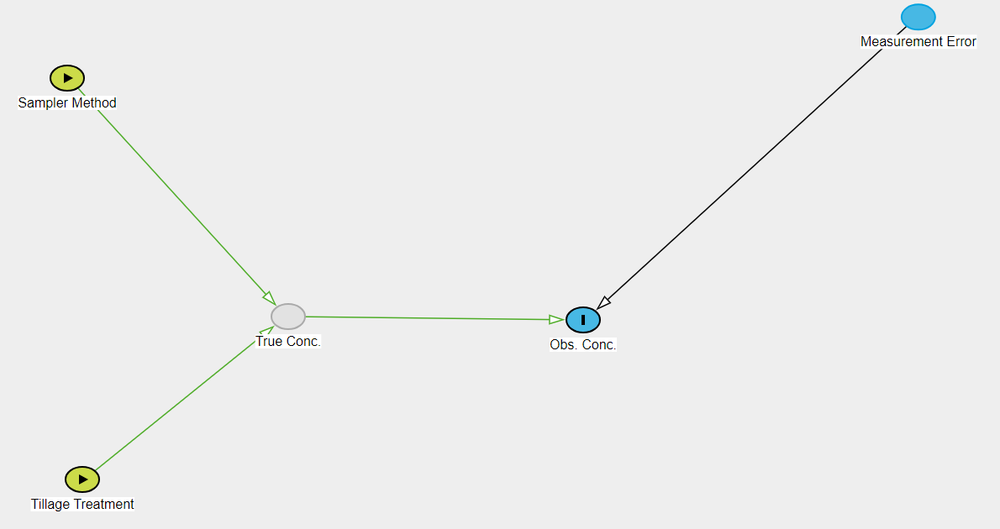

# Low-Cost IoT Technology for Runoff Water Quality Comparison with Traditional Methods
Repository Created by A.J. Brown, 27 Feb 2024
  
**Principal Investigators:** Ansley "AJ" Brown, Erik Wardle, Emmanuel Deleon, and Christina Welch  
**Affiliation:** Colorado State University, Agricultural Water Quality Program, Soil and Crop Sciences Department

## Abstract

In Colorado and across the United States, agriculture is identified as a source of nutrient pollution in state and federal waters, with nutrients such as nitrogen and phosphorus running off farmlands into surface waterways, causing quality issues. Despite the lack of regulation for agricultural nonpoint sources in Colorado, initiatives encourage adopting Best Management Practices (BMPs) to protect surface water quality. 

The Colorado State University Agricultural Water Quality Program (AWQP) has developed a low-cost, automated water sampler (LCS) with Internet of Things (IoT) technology for scalable, near-real-time water quality research. This development follows from an awarded NRCS Conservation Innovation Grant and shows promise in comparison to commercial-grade equipment and manual collection methods. The project aims to compare water quality and quantity measurements from commercial-grade equipment, the LCS IoT apparatus, and manual data collection methods at a study site in Fort Collins, CO with varying runoff water qualitites due to diverser tillage practices.

A baysian approach is used in this analysis to compare water quality measurements from the four methods due to robust quantification of uncertainty and measurement error from this approach. The results of this study will be used to inform future research and provide a methodology for evaluating other sample collection methods and technologies henceforth.

## Objective

To compare and contrast water quality and quantity measurements collected from 4 methods:

  1. **Commercial-grade equipment:** collecting first flush and subsequent hourly samples, composited for each runoff event
  2. **LCS:** collecting first flush and subsequent hourly samples, composited for each runoff event
  3. **Manual collection 1:** water samples collected in a plastic bottle by hand at first flush, then at each susbsequent hour, composited for each runoff event.
  4. **Manual collection 2:** water samples collected in a plastic bottle by hand at first flush, then at the first hour after first flush, then at the last hour of the runoff event, composited.

## Table of Contents
- [Repository Structure](#repository-structure)
- [Experimental Design and Data Collection](#experimental-design-and-data-collection)
- [Data Analysis, Results, and Discussion](#data-analysis-results-and-discussion)
- [Conclusion](#conclusion)
- [References](#references)

## Repository Structure
* `0_docs/` - contains project documentation, including code output reports
* `1_data/` - contains raw data files, including real and simulated data for testing
* `2_code/` - contains source code for data simulation, analysis testing, and real analysis
* `figs/` - contains figures needed for the repository readme file
* `LICENSE.md` - this code is licensed under the GNU General Public License v2.0

## Experimental Design and Data Collection
### Study Site

The study site is located at the CSU Agricultural Research, Development and Education Center (ARDEC) (40˚40′40″N, 104˚59′51″W) near Fort Collins, CO. Located at 1570 m above sea level, the area has an average annual precipitation of 407 mm with an average monthly maximum and minimum temperatures of 17.6 ˚C and 2.7 ˚C, occurring in July and January, respectively. Soils at the site are dominated by Garrett sandy-loams (fine-loamy, mixed, mesic type of Pachic Argiustoll; Soil Survey, 2016) with an average organic matter content of 1.8%, a pH of 7.8, and a textural profile of 52 % sand, 18 % silt, and 30 % clay. This soil type is representative of a high percentage of soils in Northern Colorado irrigated agriculture. 

In 2011, the site was established to compare two conservation tillage treatments, minimum till (MT) and strip till (ST), with a conventional tillage control treatment (CT) that is representative of typical practices in furrow irrigated fields of northern Colorado. The MT and ST treatments were selected in collaboration with a group of advising farmers interested in the feasibility of conservation tillage for furrow-irrigated systems. The field contains relatively large field plots (320 m long × 27 m wide) to realistically represent water movement in furrows and associated challenges with commercial production fields in the region. 

During the yearS of this study (2023 and 2024), the research field was planted in silage corn in late April and harvested in mid-September. Winter wheat was planted immediately afterward and will was harvested in July 2024.

### Edge-of-Field Runoff Monitoring Setup

The edge-of-field (EoF) runoff monitoring setup consists of a commercial-grade automated water sampler, an LCS, a a furrow flume. The placement of each EoF site is located at the bottom of the field, and can be seen in Figure 1:


*Figure 1.* Plot map of the conservation tillage study site where water samples will be collected, located at CSU ARDEC, Fort Collins, CO.

A more detailed depiction of the equipment and it's orientation at each EoF site can be found in Figure 2:


*Figure 2.* Edge-of-Field Runoff Monitoring Setup. The LCS and commercial sampler are located at the bottom of the field, near an installed furrow flume. Grab samples are collected by hand from water flowing through the furrow flume.  The LCS and commercial sampler use the same flume for flow measurement.


### Water Quality Analysis
Water samples collected from all sampling methods will be analyzed for the following as per NRCS Conservation Evaluation and Monitoring Activity (CEMA) 201 (NRCS, 2012): Ammonium Nitrogen (EPA 350.1), Nitrate-Nitrite (EPA353.2), Total Phosphorus (EPA365.2), Total Kjeldahl Nitrogen (A4500-NH3), Orthophosphate as P (EPA300), and Total Suspended Solids (EPA160.2). Additionally, the AWQP added the following tests to encompass salinity, pH, and biological measurements: Total Dissolved Solids (EPA 160.1), specific conductance (EPA 120.1), and pH (EPA 150.1).

Total suspended solids, specific conductance, and pH were measured at the CSU AWQP laboratory, whereas the remaining analyte analyses were outsourced to ALS Environmental within proper hold times.


## Data Analysis, Results, and Discussion

This analysis will be performed using R via Rstudio in conjunction with the `rethinking`, `cmdstanr`, and `dplyr` packages.

The procedure will be as follows:
1. Simulate a testing dataset to ensure the analysis code is functioning properly
2. Create a causal model to compare the four sampling methods using a directed acyclic graph (DAG)
3. Use the DAG to create a statistical model for the analysis
4. Create the statistical model in R using the `rethinking` package
5. Test the model using the simulated data and verify model functionality
6. Analyze the real data using the verified model
7. Interpret the results

### Simulate data
Simulated data come from an r script specifically built to represent a similar scenario with similar data, but with known influences of each variable on the result (e.g., make each sampler type have it's own bias on analyte concentration).  This will allow us to test the model and ensure it is functioning properly before using real data.

### Create a causal model

UPDATE THIS SECITON, AJ

Produced by [dagitty.net](https://www.dagitty.net/dags.html#), the causal model is a directed acyclic graph (DAG) that represents the relationships between the variables in the study.  This model will be used to create the statistical model in R.


*Figure 3.* DAG representing the causal model for the study.


Where sampler method (S) and tillage treatment (T) influence the unobserved true concentration (C), which in turn influences the observed concentration (C*). The observed concentration is also influenced by measurement error (*e*).

Here was the code used to generate the DAG:

```{r}
dag {
"Measurement Error" [pos="0.158,-1.083"]
"Obs. Conc." [outcome,pos="-0.414,-0.561"]
"Sampler Method" [exposure,pos="-1.296,-0.978"]
"Tillage Treatment" [exposure,pos="-1.270,-0.285"]
"True Conc." [latent,pos="-0.918,-0.566"]
"Measurement Error" -> "Obs. Conc."
"Sampler Method" -> "True Conc."
"Tillage Treatment" -> "True Conc."
"True Conc." -> "Obs. Conc."
}
```

### Create the statistical model
### Generalized Linear Mixed Model

The statistical model is created using a DAG and the following assumptions:

#### Observation Model:
$$
C_i \sim \text{Normal}(\mu_i, \sigma)
$$

#### Mean Structure:
$$
\mu_i = \alpha_A + \beta_{A, S} + \gamma_{A, B}
$$

Where:
- $C_i$ is the observed analyte concentration (standardized)
- $ \alpha_A $ is the analyte-specific intercept
- $ \beta_{A, S} $ is the analyte-specific effect of sampler method $ S $ (centered multivariate normal)
- $ \gamma_{A, B} $ is the analyte-specific effect of block $ B $ (centered multivariate normal)
- $ \sigma $ is the measurement error standard deviation

### Priors

#### Regular Priors:
- Measurement error:
$$
\sigma \sim \text{Exponential}(1)
$$

#### Analyte-Specific Priors:
- Intercepts for analyte $ \alpha_A $:
$$
\alpha_A \sim \text{Normal}(0, 1)
$$

- Sampler effects $ \beta_{A, S} $ (centered multivariate normal):
$$
\beta_{A, S} \sim \text{MultiNormal}(0, \text{Rho}_{\text{sampler}}, \sigma_{\text{sampler}})
$$

- Block effects $ \gamma_{A, B} $ (centered multivariate normal):
$$
\gamma_{A, B} \sim \text{MultiNormal}(0, \text{Rho}_{\text{block}}, \sigma_{\text{block}})
$$

#### Adaptive Priors:
- Covariance parameters for sampler effects:
$$
\text{Rho}_{\text{sampler}} \sim \text{LKJ}(4)
$$
$$
\sigma_{\text{sampler}} \sim \text{Exponential}(1)
$$

- Covariance parameters for block effects:
$$
\text{Rho}_{\text{block}} \sim \text{LKJ}(4)
$$
$$
\sigma_{\text{block}} \sim \text{Exponential}(1)
$$


In Summary:
- **Analyte-Specific Effects ($ \alpha_A $)**: Unique intercepts for each analyte type.
- **Sampler Effects ($ \beta_{A, S} $)**: Variance and correlation in sampler performance across analytes.
- **Block Effects ($ \gamma_{A, B} $)**: Variance and correlation in replication blocks across analytes.
- **Measurement Error ($ \sigma $)**: The standard deviation of residual error in observed concentrations.

The model enables the estimation of analyte-specific effects, accounting for variance and correlation in sampler methods and replication blocks. By leveraging adaptive priors and a multilevel framework, the model is designed to capture underlying patterns in water quality data while addressing the hierarchical structure of the experimental setup. Furthermore, the use of this Bayesian approach allowed for imputation of missing values from sample methods from two storm events where runoff occured, but none was collected except by the LCS.

### Create the statistical model in R
The source code for the statistical model can be found in `2_code/analysis_wq.Rmd`. The model chosen for this study is a non-centered version of the mathematical model presented above, and is seen in the R code as `m1.4_nc` which is shown below:

```{r, eval=FALSE, echo=FALSE}
# Prepare data for the model
data1.4 <- list(
  C_obs = sim_data_1.4$C_obs_standardized,  # Standardized observed concentrations
  S = as.numeric(as.factor(sim_data_1.4$S)), # Sampler type index (1-4)
  A = sim_data_1.4$analyte_abbr,             # Analyte index (1-9)
  B = as.numeric(as.factor(sim_data_1.4$block)), # Block index (1-2)
  N = nrow(sim_data_1.4),                    # Number of observations
  K_S = length(unique(sim_data_1.4$S)),      # Number of sampler types
  K_A = length(unique(sim_data_1.4$analyte_abbr)), # Number of analytes
  K_B = length(unique(sim_data_1.4$block))   # Number of blocks
)

# Non-centered version of m1.4 (corrected)
m1.4_nc <- ulam(
  alist(
    # Observation model
    C_obs ~ dnorm(mu, sigma),
    
    # Mean structure with correlations between analytes, samplers, and blocks
    mu <- alpha[A] + beta[A, S] + gamma[A, B],
    
    # Analyte-specific (9 levels) intercepts (non-centered parameterization)
    transpars> vector[K_A]:alpha <<- mu_alpha + z_alpha * sigma_alpha,
    vector[K_A]:z_alpha ~ normal(0, 1),  # Non-centered scaling
    mu_alpha ~ normal(0, 1),  # Prior for mean intercepts
    sigma_alpha ~ exponential(1),  # Prior for intercept variation
    
    # Analyte-specific (9 levels) sampler (4 levels) effects (non-centered parameterization)
    transpars> matrix[K_A, K_S]:beta <<- mu_beta + z_beta * diag_pre_multiply(sigma_beta, L_beta),
    transpars> matrix[K_A, K_S]:mu_beta <- rep_matrix(0, K_A, K_S),  # Center at zero
    matrix[K_A, K_S]:z_beta ~ normal(0, 1),  # Standardized effects
    transpars> cholesky_factor_corr[K_S]:L_beta ~ lkj_corr_cholesky(2),  # LKJ prior
    vector[K_S]:sigma_beta ~ exponential(1),  # Prior for scaling sampler effects
    
    # Analyte-specific (9 levels) block (2 levels) effects (non-centered parameterization)
    transpars> matrix[K_A, K_B]:gamma <<- mu_gamma + z_gamma * diag_pre_multiply(sigma_gamma, L_gamma),
    transpars> matrix[K_A, K_B]:mu_gamma <- rep_matrix(0, K_A, K_B),  # Center at zero
    matrix[K_A, K_B]:z_gamma ~ normal(0, 1),  # Standardized effects
    transpars> cholesky_factor_corr[K_B]:L_gamma ~ lkj_corr_cholesky(2),  # LKJ prior
    vector[K_B]:sigma_gamma ~ exponential(1),  # Prior for scaling block effects
    
    # Prior for measurement error
    sigma ~ exponential(1)
  ),
  data = data1.4,
  chains = 4,
  cores = 12,
  iter = 2000,              # Total iterations (increase this)
  warmup = 1000             # Number of warmup iterations (optional, default is iter/2)
)
```

### Test the model using the simulated data

AJ UPDATE THIS

Artificial values were added to the simulated data to represent the effect of sampler method, tillage treatment, irrigation event, and replication block on the observed concentration.  The model was then used to create a modified average that was then pushed through a normal distribution to represent a simulated observed concentration.  This was done twice for each combination of sampler method, tillage treatment, irrigation event, and replication block in congruence with real sampling protocol.

The modeled summary data looked like this:


*Figure 4. Simulated data summary for reference.  Bars represent average analyte concentration over all irrigations, treatments, and blocks with black error bars representing the standard deviation around the mean.*

The statistical model was then verified by running simulated data in the model where the impacts of sampler method, tillage treatement, irrigation event, and replication block were known.  The results were then compared to the known values to ensure the model was functioning properly.


*Figure 5. Effects of Sampler Method on Observed Concentration*


*Figure 6. Effects of Tillage Treatment on Observed Concentration*

### Analyze the real data
The real data was analyzed using the verified model.  The results can be found in `0_docs/analysis_real.html`.


*Figure 7. Raw data summary for reference.  Bars represent average analyte concentration over all irrigations, treatments, and blocks with black error bars representing the standard deviation around the mean.*


*Figure 8. Effects of Sampler Method on Observed Concentration*


*Figure 9. Effects of Tillage Treatment on Observed Concentration*

### Interpret the results
Looking at sampler effect distributions, **the results show that the sampler method over all analytes did not have a significant effect on the observed concentration** (i.e., Figure 8 shows distributions centered around 0, meaning no effect).  This is good news, as it means that the sampler method is not a significant source of bias in the observed concentration.

Looking at tillage effect distributions, **the results show that the tillage treatment over all analytes did not have a significant effect on the observed concentration** (i.e., Figure 9 shows distributions centered around 0, meaning no effect).  This is unexpected, as the tillage treatment was expected to have significant impacts on the observed water quality concentration.

## Conclusion
Water quality is an important aspect of agriculture, and it is important to understand the impacts of different sampling methods and tillage treatments on agricultural water quality measurements for scalable decision making and water resource management in general.  This study used a bayesian approach, using a generative model, to estimate the impacts of sampler method and tillage treatment on observed water quality concentration.  The results showed that neither the sampler method nor the tillage treatment had significant impacts on the observed water quality concentration. Regarding sampling method, this is good news, because it means that multiple sampling methods can be used in the field without significantly impacting the observed water quality concentration. Regarding tillage, however, the results are unexpected, as the tillage treatment was expected to have significant impacts on the observed water quality concentration.  Further research is needed to understand the impacts of tillage treatment on observed water quality concentration. Future work will include a more detailed analysis of the tillage treatment impacts over multiple years, and not just 2023 data as used in this study.


For more information, please [contact me](mailto:Ansley.Brown@colostate.edu)!

## References
- **McElreath R (2023).** _rethinking: Statistical
  Rethinking book package_. R package version 2.40.

- **McElreath R (2016).** _Statistical Rethinking: A Bayesian Course with Examples in R and Stan_. Chapman and Hall/CRC.