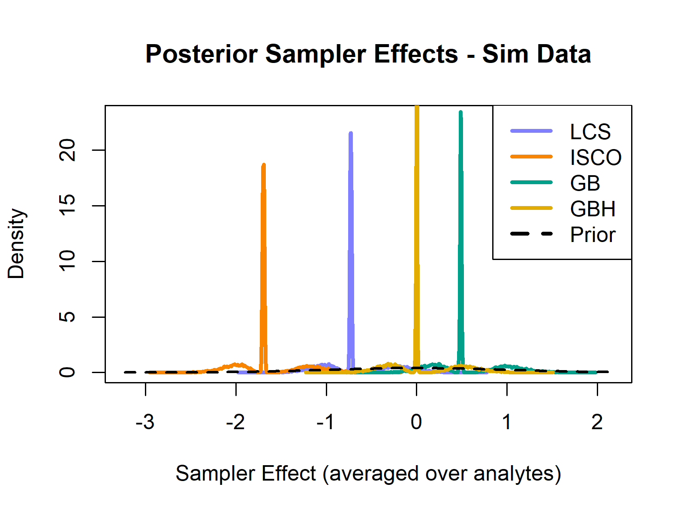
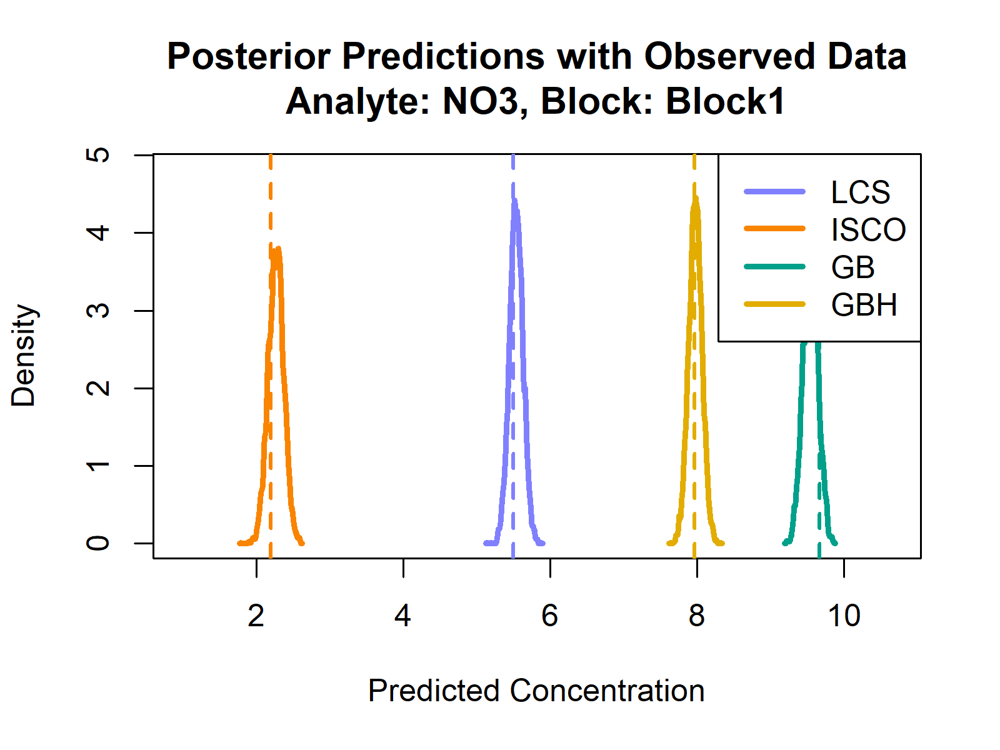
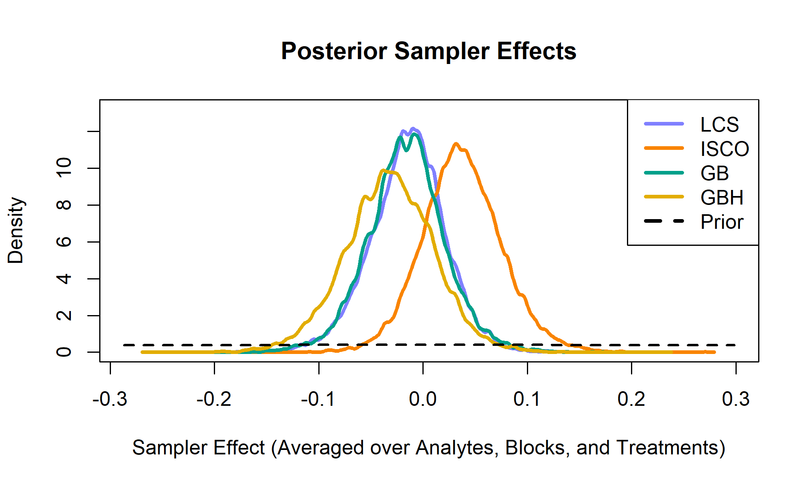

# Unveiling Biases in Water Sampling: A Bayesian Approach for Precision in Edge-of-Field Monitoring
Repository Created by A.J. Brown, 27 Feb 2024
  
**Principal Investigators:** Ansley "AJ" Brown, Erik Wardle, Emmanuel Deleon, and Jake Ladow 
**Affiliation:** Colorado State University, Agricultural Water Quality Program, Soil and Crop Sciences Department

## Abstract

In Colorado and across the United States, agriculture is identified as a source of nutrient pollution in state and federal waters, with nutrients such as nitrogen and phosphorus running off farmlands into surface waterways, causing quality issues. Despite the lack of regulation for agricultural nonpoint sources in Colorado, initiatives encourage adopting Best Management Practices (BMPs) to protect surface water quality. 

The Colorado State University Agricultural Water Quality Program (AWQP) has developed a low-cost, automated water sampler (LCS) with Internet of Things (IoT) technology for scalable, near-real-time water quality research. This development follows from an awarded NRCS Conservation Innovation Grant and shows promise in comparison to commercial-grade equipment and manual collection methods. The project aims to compare water quality and quantity measurements from commercial-grade equipment, the LCS IoT apparatus, and manual data collection methods at a study site in Fort Collins, CO with varying runoff water qualitites due to diverser tillage practices.

A baysian approach is used in this analysis to compare water quality measurements from the four methods due to robust quantification of uncertainty and measurement error from this approach. The results of this study will be used to inform future research and provide a methodology for evaluating other sample collection methods and technologies henceforth.

## Objective

To compare and contrast water quality and quantity measurements collected from 4 methods:

  1. **Commercial-grade equipment:** collecting first flush and subsequent hourly samples, composited for each runoff event
  2. **LCS:** collecting first flush and subsequent hourly samples, composited for each runoff event
  3. **Manual collection 1:** water samples collected in a plastic bottle by hand at first flush, then at each susbsequent hour, composited for each runoff event.
  4. **Manual collection 2:** water samples collected in a plastic bottle by hand at first flush, then at the first hour after first flush, then at the last hour of the runoff event, composited.

## Table of Contents
- [Repository Structure](#repository-structure)
- [Experimental Design and Data Collection](#experimental-design-and-data-collection)
- [Data Analysis, Results, and Discussion](#data-analysis-results-and-discussion)
- [Conclusion](#conclusion)
- [References](#references)

## Repository Structure
* `0_docs/` - contains project documentation, including code output reports
* `1_data/` - contains raw data files, including real and simulated data for testing
* `2_code/` - contains source code for data simulation, analysis testing, and real analysis
* `figs/` - contains figures needed for the repository readme file
* `LICENSE.md` - this code is licensed under the GNU General Public License v2.0

## Experimental Design and Data Collection
### Study Site

The study site is located at the CSU Agricultural Research, Development and Education Center (ARDEC) (40˚40′40″N, 104˚59′51″W) near Fort Collins, CO. Located at 1570 m above sea level, the area has an average annual precipitation of 407 mm with an average monthly maximum and minimum temperatures of 17.6 ˚C and 2.7 ˚C, occurring in July and January, respectively. Soils at the site are dominated by Garrett sandy-loams (fine-loamy, mixed, mesic type of Pachic Argiustoll; Soil Survey, 2016) with an average organic matter content of 1.8%, a pH of 7.8, and a textural profile of 52 % sand, 18 % silt, and 30 % clay. This soil type is representative of a high percentage of soils in Northern Colorado irrigated agriculture. 

In 2011, the site was established to compare two conservation tillage treatments, minimum till (MT) and strip till (ST), with a conventional tillage control treatment (CT) that is representative of typical practices in furrow irrigated fields of northern Colorado. The MT and ST treatments were selected in collaboration with a group of advising farmers interested in the feasibility of conservation tillage for furrow-irrigated systems. The field contains relatively large field plots (320 m long × 27 m wide) to realistically represent water movement in furrows and associated challenges with commercial production fields in the region. 

During the years of this study (2023 and 2024), the research field was planted in silage corn in late April and harvested in mid-September. Winter wheat was planted immediately afterward and will was harvested in July 2024.

Study Site summary:
- Fort Collins, CO, USA
- Conservation Tillage Study started in 2011
  - CT = Full tillage
  - ST = Less tillage
  - MT = Least tillage
- Replicated management blocks
- Each plot is about 1 hectare with a 300m irrigation run length
- Surface irrigated with gated pipe for 7-10 hours at a time


### Edge-of-Field Runoff Monitoring Setup

The edge-of-field (EoF) runoff monitoring setup consists of a commercial-grade automated water sampler, an LCS, a a furrow flume. The placement of each EoF site is located at the bottom of the field, and can be seen in Figure 1:


*Figure 1.* Plot map of the conservation tillage study site where water samples will be collected, located at CSU ARDEC, Fort Collins, CO.

A more detailed depiction of the equipment and it's orientation at each EoF site can be found in Figure 2:


*Figure 2.* Edge-of-Field Runoff Monitoring Setup. The LCS and commercial sampler are located at the bottom of the field, near an installed furrow flume. Grab samples are collected by hand from water flowing through the furrow flume.  The LCS and commercial sampler use the same flume for flow measurement.

Four sampling methods were compared overall:

1. **LCS:** low-cost automated sampler developed at CSU sampling hourly into a composite bottle - [GitHub Repository Found Here](https://github.com/CSU-Agricultural-Water-Quality-Program/low-cost-iot-water-sampler)
2. **ISCO:** commercial automated sampler sampling hourly into a composite bottle
3. **GBH:** water collected by hand each hour and put into a composite bottle
4. **GB:** water collected by hand only at the “first flush”, the first hour into an event, and the last hour of an event

### Collected Data characteristics
- Events: 6 Irrigations, 2 Storms
- For each event:
  - Each sampling method collected a primary and duplicate sample
  - Water was taken to our lab, preserved, and tested for 9 analytes
- 310 unique water samples collected in total
  - 6 irrigations * 6 plots * 4 methods * 2 samples = 288
  - Storm 1 = 6 plots * 1 method * 2 samples = 18
  - Storm 2 = 2 plots * 1 method * 2 samples = 4
- Only LCS collected the storms b/c the ISCOs had no modem, and personnel could not be present to sample manually  missing data problem (191 points)

### Water Quality Analysis
Water samples collected from all sampling methods will be analyzed for the following as per NRCS Conservation Evaluation and Monitoring Activity (CEMA) 201 (NRCS, 2012): Ammonium Nitrogen (EPA 350.1), Nitrate-Nitrite (EPA353.2), Total Phosphorus (EPA365.2), Total Kjeldahl Nitrogen (A4500-NH3), Orthophosphate as P (EPA300), and Total Suspended Solids (EPA160.2). Additionally, the AWQP added the following tests to encompass salinity, pH, and biological measurements: Total Dissolved Solids (EPA 160.1), specific conductance (EPA 120.1), and pH (EPA 150.1).

Total suspended solids, specific conductance, and pH were measured at the CSU AWQP laboratory, whereas the remaining analyte analyses were outsourced to ALS Environmental within proper hold times.


## Data Analysis, Results, and Discussion

This analysis will be performed using R via Rstudio in conjunction with the `rethinking`, `cmdstanr`, and `dplyr` packages.

The procedure will be as follows:
1. Simulate a testing dataset to ensure the analysis code is functioning properly
2. Create a causal model to compare the four sampling methods using a directed acyclic graph (DAG)
3. Use the DAG to create a statistical model for the analysis
4. Create the statistical model in R using the `rethinking` package
5. Test the model using the simulated data and verify model functionality
6. Analyze the real data using the verified model
7. Interpret the results

### Simulate data
Simulated data come from an r script specifically built to represent a similar scenario with similar data, but with known influences of each variable on the result (e.g., make each sampler type have it's own bias on analyte concentration).  This will allow us to test the model and ensure it is functioning properly before using real data.

### Create a causal model
Produced by [dagitty.net](https://www.dagitty.net/dags.html#), the causal model is a directed acyclic graph (DAG) that represents the relationships between the variables in the study.  This model will be used to create the statistical model in R.


*Figure 3.* DAG representing the causal model for the study.


Where sampler method (S), Analyte type (A), and experimental block (B) influence the observed analyte concentration (C). The observed concentration is also influenced by other uncertainty that is unobserved (*e*). Green nodes represent exposures, blue nodes represent outcomes, and grey nodes represent unobserved variables.

Here was the code used to generate the DAG:

```{r}
dag {
bb="-3.052,-3.426,2.385,2.376"
"Observed Concentration" [outcome,pos="-0.456,-0.248"]
"Other Uncertainty" [latent,pos="1.329,-2.365"]
"Sampler Method" [exposure,pos="-1.336,-1.831"]
Analyte [exposure,pos="-2.142,-0.196"]
Block [exposure,pos="-1.343,1.451"]
"Other Uncertainty" -> "Observed Concentration"
"Sampler Method" -> "Observed Concentration"
Analyte -> "Observed Concentration"
Analyte -> "Sampler Method"
Analyte -> Block
Block -> "Observed Concentration"
}
```

### Create the statistical model
### Generalized Linear Mixed Model
Using the above DAG as a guide, we can create a statistical model to analyze the data. In this case, we will use a generalized linear mixed model (GLMM) to model the concentration results for each analyte, sampler and block.  

#### Observation Model:
$$
C_i \sim \text{Normal}(\mu_i, \sigma_{A})
$$

#### Mean Structure:
$$
\mu_i = \alpha_A + \beta_{A, S} + \gamma_{A, B} + \delta_{A, T}
$$

Where:
- $C_i$ is the observed analyte concentration (standardized)
- $ \alpha_A $ is the analyte mean concentration (i.e., the mean concentration of analyte $ A $ when block and sampler effects are zero)
- $ \beta_{A, S} $ is the analyte-specific effect of sampler method $ S $ (centered multivariate normal)
- $ \gamma_{A, B} $ is the analyte-specific effect of block $ B $ (centered multivariate normal)
- $ \delta_{A, T} $ is the analyte-specific effect of treatment $ T $ (centered multivariate normal)
- $ \sigma_A $ is the standard deviation for each analyte $ A $

### Priors

#### Regular Priors:
- Measurement error:
$$
\sigma_{A} \sim \text{Exponential}(1)
$$

#### Analyte-Specific Priors:
- Intercepts for analyte $ \alpha_A $:
$$
\alpha_A \sim \text{Normal}(0, 1)
$$

- Sampler effects $ \beta_{A, S} $:
$$
\beta_{A, S} \sim \text{MVN}([0,0,0,0], \text{R}_{\text{S}}, \text{S}_{\text{S}})
$$

- Block effects $ \gamma_{A, B} $:
$$
\gamma_{A, B} \sim \text{MVN}([0,0], \text{R}_{\text{B}}, \text{S}_{\text{B}})
$$

- Treatment effects $ \delta_{A, T} $:
$$
\delta_{A, T} \sim \text{MVN}([0,0,0], \text{R}_{\text{T}}, \text{S}_{\text{T}})
$$

#### Adaptive Priors:
- Standard deviation priors for each sampler and block in the MVN distributions:
$$
\text{S}_{\text{S}}, \text{S}_{\text{B}}, \text{S}_{\text{T}} \sim \text{Exponential}(1)
$$


- Correlation (i.e, covariance) priors for each sampler and block in the MVN distributions:
$$
\text{R}_{\text{S}}, \text{R}_{\text{B}}, \text{R}_{\text{T}} \sim \text{LKJcorr}(2)
$$


In Summary:
- **Analyte-Specific Effects ($ \alpha_A $)**: Unique intercepts for each analyte type.
- **Sampler Effects ($ \beta_{A, S} $)**: Variance and correlation in sampler performance across analytes.
- **Block Effects ($ \gamma_{A, B} $)**: Variance and correlation in replication blocks across analytes.
- **Treatment Effects ($ \delta_{A, T} $)**: Variance and correlation in tillage treatment across analytes.
- **Other Uncertainty ($ \sigma_{A} $)**: The standard deviation of residual error in observed concentrations.

The model enables the estimation of analyte-specific effects, accounting for variance and correlation in sampler methods and replication blocks. By leveraging adaptive priors and a multilevel framework, the model is designed to capture underlying patterns in water quality data while addressing the hierarchical structure of the experimental setup. Furthermore, the use of this Bayesian approach allowed for imputation of missing values from sample methods from two storm events where runoff occured, but none was collected except by the LCS.

### Create the statistical model in R
To calibrate and run the model, we will use Hamiltonian Monte Carlo (HMC) to via Stan (i.e., `cmdstanr`) and the `rethinking` package in R. The source code for the statistical model can be found in `2_code/analysis_wq.Rmd`. The model chosen for this study is a mathematically equivalent, [non-centered parameterization](https://mc-stan.org/docs/2_18/stan-users-guide/reparameterization-section.html) of the model presented above for better convergence and sampling efficacy. The is seen in the R code as `m1.4_nc` shown below:

```{r, eval=FALSE, echo=FALSE}
# Prepare data for the model
data1.6 <- list(
  C_obs = sim_data_1.6$C_obs_standardized,  # Standardized observed concentrations
  S = as.numeric(as.factor(sim_data_1.6$S)), # Sampler type index (1-4)
  A = sim_data_1.6$analyte_abbr,             # Analyte index (1-9)
  B = as.numeric(as.factor(sim_data_1.6$block)), # Block index (1-2)
  TRT = as.numeric(as.factor(sim_data_1.6$treatment)), # Treatment index (1-3)
  N = nrow(sim_data_1.6),                    # Number of observations
  K_S = length(unique(sim_data_1.6$S)),      # Number of sampler types
  K_A = length(unique(sim_data_1.6$analyte_abbr)), # Number of analytes
  K_B = length(unique(sim_data_1.6$block)),  # Number of blocks
  K_T = length(unique(sim_data_1.6$treatment))     # Number of treatments
)

# Non-centered version
m1.6_nc <- ulam(
  alist(
    # Observation model
    C_obs ~ normal(mu, sigma_analyte[A]),
    
    # Mean structure with correlations between analytes, samplers, and blocks
    mu <- alpha[A] + beta[A, S] + gamma[A, B] + delta[A, TRT],
    
    # Analyte-specific (9 levels) intercepts (non-centered parameterization)
    transpars> vector[K_A]:alpha <<- mu_alpha + z_alpha * sigma_alpha,
    vector[K_A]:z_alpha ~ normal(0, 1),  # Non-centered scaling
    mu_alpha ~ normal(0, 1),  # Prior for mean intercepts
    sigma_alpha ~ exponential(1),  # Prior for intercept variation
    
    # Analyte-specific (9 levels) sampler (4 levels) effects (non-centered parameterization)
    transpars> matrix[K_A, K_S]:beta <<- mu_beta + z_beta * diag_pre_multiply(sigma_beta, L_beta),
    transpars> matrix[K_A, K_S]:mu_beta <- rep_matrix(0, K_A, K_S),  # Center at zero
    matrix[K_A, K_S]:z_beta ~ normal(0, 1),  # Standardized effects
    transpars> cholesky_factor_corr[K_S]:L_beta ~ lkj_corr_cholesky(2),  # LKJ prior
    vector[K_S]:sigma_beta ~ exponential(1),  # Prior for scaling sampler effects
    
    # Analyte-specific (9 levels) block (2 levels) effects (non-centered parameterization)
    transpars> matrix[K_A, K_B]:gamma <<- mu_gamma + z_gamma * diag_pre_multiply(sigma_gamma, L_gamma),
    transpars> matrix[K_A, K_B]:mu_gamma <- rep_matrix(0, K_A, K_B),  # Center at zero
    matrix[K_A, K_B]:z_gamma ~ normal(0, 1),  # Standardized effects
    transpars> cholesky_factor_corr[K_B]:L_gamma ~ lkj_corr_cholesky(2),  # LKJ prior
    vector[K_B]:sigma_gamma ~ exponential(1),  # Prior for scaling block effects
    
    # Analyte-specific (9 levels) treatment (3 levels) effects (non-centered parameterization)
    transpars> matrix[K_A, K_T]:delta <<- mu_delta + z_delta * diag_pre_multiply(sigma_delta, L_delta),
    transpars> matrix[K_A, K_T]:mu_delta <- rep_matrix(0, K_A, K_T),  # Center at zero
    matrix[K_A, K_T]:z_delta ~ normal(0, 1),  # Standardized effects
    transpars> cholesky_factor_corr[K_T]:L_delta ~ lkj_corr_cholesky(2),  # LKJ prior
    vector[K_T]:sigma_delta ~ exponential(1),  # Prior for scaling treatment effects
    
    # Prior for measurement error
    vector[K_A]:sigma_analyte ~ exponential(1)
  ),
  data = data1.6,
  chains = 4,
  cores = 12,
  iter = 4000,              # Total iterations (increase this)
  warmup = 1000             # Number of warmup iterations (optional, default is iter/2)
)
```

### Test the model using the simulated data

Artificial data were simulated to represent the effect of sampler method and block on each analyte concentration.  The simulation models the effects of sampler type and block on observed concentrations for nine water quality analytes observed in the real data. Below are the key details of the simulation:

#### Simulated data characteristics

**Sampler Type Effects**

Four sampler types were modeled, each with a "true intercept" representing its efficiency:
- **LCS**: Intercept = 0.7, moderate underestimation.
- **ISCO**: Intercept = 0.3, substantial underestimation.
- **GB**: Intercept = 1.2, slight overestimation.
- **GBH**: Intercept = 1.0, accurate measurement.

**Block Effects**

Two blocks simulate environmental conditions:
- **Block1**: Baseline, with no adjustment to true concentrations.
- **Block2**: A 20% reduction in concentrations compared to true value.

**Treatment Effects**

Three treatments simulate tillage impacts on runoff water quality:
- **CT**: conventional tillage, 20% increase relative to true value
- **MT**: Minimum tillage, no adjustment to true value
- **ST**: conventional tillage, 20% decrease relative to true value

**True Analyte Concentration Values**

Here are the "True" mean and standard deviation values for each analyte that were to be estimated, and then modiefied by the above parameters to simulate sampler and block effects:

*Table 1. True means and standard deviations used in the simulated data prior to modifying it with block and sampler effects.*
| **Analyte** | **True Mean (mg/L)** | **True Standard Deviation (mg/L)** |
|-------------|-----------------------|-------------------------------|
| NO3         | 8.0                  | 1.0                           |
| NO2         | 0.1                  | 0.01                          |
| TKN         | 5.0                  | 1.0                           |
| pH          | 7.0                  | 0.1                           |
| TP          | 0.8                  | 0.1                           |
| OP          | 0.3                  | 0.05                          |
| EC          | 0.15                 | 0.01                          |
| TSS         | 1000.0               | 200.0                         |
| TDS         | 500.0                | 50.0                          |

**Observed Concentration Calculation**

The true values were modified by the effects of sampler and block using the equation below. This process was repeated 50 times for each sampler, block, and analyte, resulting in **3600 rows of simulated data** (i.e., 4 samplers × 9 analytes × 2 blocks x 50 replications).

$$
\mu_{analyte} = \text{Base Mean}_{analyte} - \text{Base Mean}_{analyte} \times (1 - \text{Sampler Intercept}) - \text{Base Mean}_{analyte} \times (1 - \text{Block Effect}) + \text{Random Noise}
$$

$$
C_{\text{obs}} \sim \text{Normal}(\mu_{analyte}, \sigma_{analyte})
$$

#### Calibration results on simulated data

The model was calibrated using these simulated data, and tested to ensure that the model characterized results as expected. The modeled summary data looked like this:

*Table 2. Simulated data summary showing the impact of block and sampler method on each analyte concentration.*

| Analyte Name | Block   | LCS    | ISCO   | GB     | GBH    |
|--------------|---------|--------|--------|--------|--------|
| NO3          | Block1  | 5.50   | 2.20   | 9.67   | 7.97   |
| NO3          | Block2  | 4.05   | 0.745  | 7.79   | 6.55   |
| NO2          | Block1  | 0.0710 | 0.0278 | 0.118  | 0.101  |
| NO2          | Block2  | 0.0512 | 0.00786| 0.101  | 0.0813 |
| TKN          | Block1  | 3.41   | 1.48   | 6.02   | 5.00   |
| TKN          | Block2  | 2.57   | 0.498  | 4.86   | 3.89   |
| pH           | Block1  | 4.88   | 2.11   | 8.41   | 7.00   |
| pH           | Block2  | 3.48   | 0.706  | 6.99   | 5.62   |
| TP           | Block1  | 0.552  | 0.269  | 0.961  | 0.774  |
| TP           | Block2  | 0.414  | 0.0890 | 0.821  | 0.629  |
| OP           | Block1  | 0.212  | 0.0925 | 0.358  | 0.305  |
| OP           | Block2  | 0.146  | 0.0277 | 0.301  | 0.235  |
| EC           | Block1  | 0.104  | 0.0442 | 0.180  | 0.150  |
| EC           | Block2  | 0.0771 | 0.0142 | 0.150  | 0.120  |
| TSS          | Block1  | 642.   | 288.   | 1208.  | 1026.  |
| TSS          | Block2  | 494.   | 97.0   | 980.   | 821.   |
| TDS          | Block1  | 348.   | 153.   | 613.   | 486.   |
| TDS          | Block2  | 242.   | 48.5   | 516.   | 397.   |


The posterior distributions showing the impact of sampler method averaged over all blocks and anlalytes also carried the correct trends in accordance with the simulated data:



*Figure 4. Effects of Sampler Method on Observed Concentration averaged over analyte and block*

The final test is to push out analyte predictions using the calibrated model and plotting the 'true' simulated data values over it to see how the model performs.  The results were good, with the model accurately centering posterior predictions over the simulated 'true' values.  Here is an example of that with Nitrate (NO3):



*Figure 5. Generative model posterior prediction of nitrate concentration with "True" mean values overlain as vertical dashed lines.*

### Analyze the real data
After validating the model's accuracy with simulated data, the real data was analyzed using the model.




*Figure 8. Effects of Sampler Method on Observed Concentration*


*Figure 7. Generative model posterior prediction of all analytes
### Interpret the results

- All Samplers have pretty decent agreement
  - The ISCO tends to bias high
  - LCS agrees with GB and GBH pretty well
  - The LCS is "best"
- When it comes to individual analytes, sampling method can make a significant difference
  - TSS = ISCO biased way high
  - NO3 = ISCO not biased much at all


## Conclusion

Water quality is an important aspect of agriculture, and it is important to understand the impacts of different sampling methods and tillage treatments on agricultural water quality measurements for scalable decision making and water resource management in general.  This study used a bayesian approach, using a generative model, to estimate the impacts of sampler method and on observed water quality concentration. Our study demonstrates that while all four sampling methods—ISCO, Low-Cost Sampler (LCS), Grab Sampling (GB), and Hourly Grab Sampling (GBH)—showed reasonable agreement in capturing edge-of-field runoff water quality, notable biases emerged depending on the sampler and analyte. The ISCO sampler often exhibited a positive bias, particularly evident in non-soluble analytes like Total Suspended Solids (TSS), where readings were significantly inflated compared to other methods. In contrast, for soluble analytes like Nitrate (NO₃), ISCO's bias was minimal, suggesting that sampler performance can vary greatly depending on the specific water quality parameter being measured, and likely relating to the analyte's solubility.

The Low-Cost Sampler (LCS) showed strong alignment with both GB and GBH, positioning it as the most reliable and consistent method across multiple analytes. This finding is particularly important given the LCS’s affordability and potential for broader application in resource-limited monitoring programs.

Our results also highlight that sampling method selection can significantly influence individual analyte measurements, emphasizing the importance of understanding sampler-specific biases when interpreting water quality data.

Looking forward, future work will focus on enhancing our Bayesian model to incorporate additional complexities, such as treatment effects (Trt), correlations between analytes for improved inference, and the impact of irrigation practices on nutrient runoff. Furthermore, we plan to visualize the impact of imputing missing data, particularly from Storm 1 and Storm 2 events. Leveraging Bayesian methods for imputation allowed us to 'guess' missing values based on the observed data, which improved model robustness and precision. This capability demonstrates the power of Bayesian frameworks in handling sparse datasets, a common challenge in environmental monitoring.

Our findings lay a foundation for integrating Bayesian methodologies into edge-of-field water quality monitoring, providing a more accurate and nuanced understanding of how agricultural practices influence nutrient runoff.


For more information, please [contact me](mailto:Ansley.Brown@colostate.edu)!

## References
- **McElreath R (2023).** _rethinking: Statistical Rethinking book package_. R package version 2.40.

- **McElreath R (2016).** _Statistical Rethinking: A Bayesian Course with Examples in R and Stan_. Chapman and Hall/CRC.

- **Stan Development Team (2023).** _Stan Modeling Language User's Guide and Reference Manual_. Version 2.33. [https://mc-stan.org](https://mc-stan.org).

- **Gabry J, Češnovar R, Johnson A, Bronder S (2024).** _cmdstanr: R Interface to 'CmdStan'. R package version 0.8.1_, https://discourse.mc-stan.org, https://mc-stan.org/cmdstanr/.
